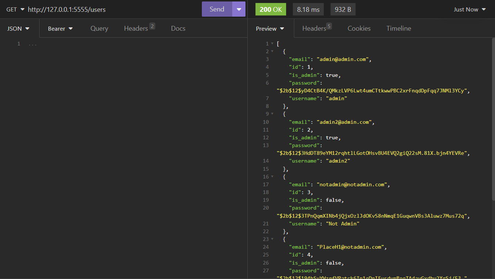

# T2A2 API Webserver Project
## Valentinas Kornijenka
[Github Repo](https://github.com/ValK-98/api-web-server)

### **R1 - Identification of the problem you are trying to solve by building this particular app.**

I am building an API app to serve as a smartwatch comparison tool. Currently it is difficult for users to get concise information on the plethora of available smartwatches on the market. For users to do research of smartwatches they would like to purchase they typically have to go through websites and Youtube videos which either have a lot of filler text or Youtube videos that sometimes can take a considerable amount to watch. This app would allow users to look up smartwatches and quickly see their features. 

### **R2 - Why is it a problem that needs solving?**

The smartwatch industry is fast growing and as with other fields of tech there are constant new updates and improvements with each new generation of smartwatches. As the smartwatch industry is relatively new, the typical consumer looking to purchase a smartwatch has an overwhelming amount of options to pick from. For example, Apple alone has 5 variants of current generation smartwatch while Garmin has 6 main models and a few other variants that they offer. This leads to an immense amount of research needed to make an informed purchase. Users have to consider factors such as looks, battery life, durability and how the product suits their lifestyle. Not to mention the different health features that smartwatches have to set them apart. All whilst figuring out which of the aforementioned features work the most consistently and reliably. Company websites don't tend to give a streamline and objective comparison of their models versus competitors but internet articles and Youtube videos can be quite lengthy with a lot of filler. By solving this issue we provide the user with a centralized, concise database that would save time and help them make an informed decision. 

### **R3 - Why have you chosen this database system. What are the drawbacks compared to others?**

I've chose to use PostgreSQL for this project as it's reliable and able to manage large amounts of data. Additionally, it's open-source, widely used and is fully ACID compliant. 

Part of the selection process was comparing it to other database systems, such as MongoDB. Here are the drawbacks of each:

### Drawbacks of PostgreSQL: 
* Performance can be slower than NoSQL databases when handling volumes of write-heavy transactions. 
* Lack of flexibility due to using a schema structure, which requires defining schemas in advance. As apps evolve this can cause issues since schemas may need to be updated as apps advance. 
* Limited built-in tools for certain tasks such as full-text search and handling geographic data. This can cause additional workload on processing as these tools are not natively available. 
* Whilst PostgreSQL has a large community support, in a commercial setting support may be more limited compared to more enterprise focused databases.


### Drawbacks of MongoDB: 
* MongoDB can use more memory & storage due to it storing data in BSON format. 
* Lack of rigidity can cause issues in data normalization. It additionally does not enforce foreign key constraints which can cause issues for data integrity.
* MongoDB has a document size limit which forces a careful design of databases. 
* There is potential for over-indexing which can lead to overheads in terms of storage and can impact write performance. 

The choice between MongoDB and PostgreSQL is highly situational. They are both strong choices for databases systems, however for different needs. If using complex queries and ensuring ACID compliance are important - PostgreSQL is the best choice. On the other hand, if fast write operations are needed as well as the handling of unstructured data then MongoDB may be preferable. As the latter will not be necessary for this project, PostgreSQL is a better choice. 

Sources:

https://kinsta.com/blog/mongodb-vs-postgresql/#mongodb-vs-postgresql-headtohead-comparison

https://aws.amazon.com/compare/the-difference-between-mongodb-and-postgresql

https://www.mongodb.com/compare/mongodb-postgresql


### **R4 - Identify and discuss the key functionalities and benefits of an ORM**

An Object-Relational Mapping (ORM) is a programming technique that is used to map incompatible data from a programming language into data that a relational database can use. 

**Some of it's key functionalities are:**

* Data Abstraction:
    * ORM abstract the database system, allowing developers to work with data as objects, reducing the need to write SQL queries. However, this can sometimes lead to inefficient queries if the ORM is not used carefully.

* Database Synchronization:
    * ORM synchronizes the database schema with the application model. Changes in the model can be automatically propagated to the database schema. In large projects however, this can lead to a need to have the database schema carefully managed to prevent mistakes or data loss.

* CRUD Operations:
    * Simplifies Create, Read, Update, and Delete (CRUD) operations. Developers interact with objects rather than SQL. Sometimes this can hide the complexity of the operations thus impacting the performance implications.

* Query Capability:
    * Provides a querying capability that lets developers write queries using the programming language's features rather than SQL. But sometimes this can be less effective than writing native SQL queries, especially for complex operations. 


**Some of it's key benefits are:**

* Increased Productivity:
    * Automates boilerplate code for database operations, allowing developers to focus on business logic. However this can lead to a potential lack of understanding of the underlying database operations. 

* Maintainability:
    * Code is more maintainable and understandable, as it aligns with the application's domain model. However the nuance is that complex queries can become more convoluted.

* Reduced SQL Injection Risk:
    * By abstracting SQL queries, ORMs can reduce the risk of SQL injection attacks. However, this does not eliminate the need for careful security practices. Especially if raw SQL is still used for complex queries. 

* Integration with Application Logic:
    * Seamless integration with the programming language's own constructs. But, this can sometimes lead to a blurring of boundaries between the database layer and application logic.


ORMs provide a convenient and efficient way to interact with databases, however their use requires an understanding of their limitations as well as the database system in use. 

### **R5 - Document all endpoints for your API**

## User Endpoints: ## 

### /smartwatches
* Description: Retrieves a list of smartwatch models, optionally based on their specified criteria.
* Required data: None
* Optional data: Query parameters for filtering: `budget`, `battery_life`, `main_feature`, `name`, `brand`, `year_released`
* HTTP Method: `GET`
* Expected response: `200 OK`
* Authentication: Valid JWT token for user


### /smartwatches/`<int:smartwatch_id>`
* Description: Gets information of specific model
* Required data: `smartwatch_id` referenced in the request header
* HTTP Method: `GET`
* Expected response: `200 OK`
* Authentication: Valid JWT token for user


### /user_smartwatches
* Description: Allows users to get saved smartwatch information associated with their ID
* Required data: none
* HTTP Method: `GET`
* Expected response: `200 OK`
* Authentication: Valid JWT token for user


### /user_smartwatches/`<int:smartwatch_id>`
* Description: Allows users to add watch to `user_smartwatches`
* Required data: `smartwatch_id` included as JSON in body
* Optional data: Query parameters for filtering: `budget`, `battery_life`, `main_feature`, `name`, `brand`, `year_released` included as JSON in body
* HTTP Method: `POST`
* Expected response: `201 CREATED`
* Authentication: Valid JWT token for user


### /user_smartwatches/`<int:smartwatch_id>`
* Description: Allows users to delete `user_smartwatches`
* Required data: `smartwatch_id` referenced in the request header
* HTTP Method: `DELETE`
* Expected response: `200 OK`
* Authentication: Valid JWT token for user


## Admin Endpoints: ## 

### /smartwatches
* Description: Add a new smartwatch model
* Required data: Smartwatch model details: `budget`, `battery_life`, `main_feature`, `name`, `brand`, `year_released`
* HTTP Method: `POST`
* Expected response: `201 CREATED`
* Authentication: JWT token, admin_required()


### /smartwatches/`<int:model_id>`
* Description: Update information of existing model
* Required data: `model_id` referenced in the request header. smartwatch model details: `budget`, `battery_life`, `main_feature`, `name`, `brand`, `year_released`
* HTTP Method: `PUT`
* Expected response: `200 OK`
* Authentication: JWT token, admin_required()


### /smartwatches/`<int:model_id>`
* Description: Permits admins to remove a smartwatch model from database
* Required data: `model_id` referenced in the request header
* HTTP Method: `DELETE`
* Expected response: `200 OK`
* Authentication: JWT token, admin_required()


### /user_smartwatches/users/all
* Description: Allows admin to get all users `user_smartwatches` information
* Required data: none
* HTTP Method: `GET`
* Expected response: `200 OK`
* Authentication: JWT token, admin_required()


### /user_smartwatches/users/`<int:user_id>`
* Description: Allows admin to get specific user `user_smartwatches` information
* Required data: `user_id` referenced in the request header
* HTTP Method: `GET`
* Expected response: `200 OK`
* Authentication: JWT token, admin_required()


### /users
* Description: Allows admins to view a list of all registered users.
* Required data: None
* HTTP Method: `GET`
* Expected response: `200 OK`
* Authentication: JWT token, admin_required()



### /users/`<int:user_id>`
* Description: Allows admins to look up a user
* Required data: `user_id` referenced in the request header
* HTTP Method: `GET`
* Expected response: `200 OK`
* Authentication: JWT token, admin_required()


### /users/`<int:user_id>`
* Description: Allows admins to delete an existing user
* Required data: `user_id` referenced in the request header
* HTTP Method: `DELETE`
* Expected response: `200 OK`
* Authentication: JWT token, admin_required()


## Authentication Endpoints: ## 

### /register
* Description: Allows creation of new account
* Required data: User credentials: `username`, `password`, `email`
* HTTP Method: `POST`
* Expected response: `201 CREATED`
* Authentication: None


### /login
* Description: Authenticates user credentials and provides a token for accessing user-specific endpoints.
* Required data: User credentials: `email`, `password`
* HTTP Method: `POST`
* Expected response: `200 OK`
* Authentication: `email`, `password`


### **R6 - An ERD for your app**


### **R7 - Detail any third party services that your app will use**

For the purposes of this app, the following will be used:

1. *Flask:* A lightweight web framework for Python. It's designed to be simple and easy to use, allowing you to quickly build web applications by providing tools, libraries, and technologies. Flask offers simplicity, flexibility, and fine-grained control.
SQLAlchemy: An SQL toolkit and Object-Relational Mapping (ORM) library for Python. It provides a full suite of well-known enterprise-level persistence patterns, designed for efficient and high-performing database access.

2. *PostgreSQL:* An open-source, powerful, and advanced relational database system. It's known for its robustness, scalability, and support for advanced data types and complex queries.

3. *Psycopg2:* A PostgreSQL adapter for Python. It's a popular choice for connecting Python applications to a PostgreSQL database, allowing you to execute PostgreSQL commands from Python.

4. *Marshmallow:* A library for object serialization and deserialization in Python. It turns complex data types, like objects, into Python native data types that can then be easily rendered into JSON, XML, or other content types. It's commonly used for parsing and validating data for Flask applications.

5. *Bcrypt:* A password hashing function. In Python, it's commonly used for securely storing user passwords. By hashing passwords, Bcrypt provides a way to store and manage secure passwords.

6. *JWT Manager (JSON Web Token):* A method for securely transmitting information between parties as a JSON object. In Python, JWT is often used for authentication in web applications, where the server generates a token that certifies the user's identity and is then used for secured communication.

### **R8 - Describe your projects models in terms of the relationships they have with each other**

#### *Users model*: 
* The Users model contains the schema for the users registering & logging in. It has a one to many relationship with user_smartwatches. This allows the user to store multiple smartwatches that the app outputs. The users model will be referenced as a foreign key inside of user_smartwatches.

```python
class User(db.Model):
    __tablename__ = "users"
    id = db.Column(db.Integer, primary_key=True)
    username = db.Column(db.String, nullable=False)
    email = db.Column(db.String, nullable=False, unique=True)
    password = db.Column(db.String, nullable=False)
    is_admin = db.Column(db.Boolean, default=False)
    smartwatches = db.relationship('UserSmartwatch', back_populates='user', cascade="all, delete-orphan")
```

#### *Smartwatches model:*
* The smartwatches model contains the schema for the smartwatches inside the database. It has a many to many relationship with user_smartwatches. This lets multiple users to be associated with the smartwatches, and the smartwatches can be associated with multiple users. The foreign key of the smartwatches model is used in user_smartwatches to reference the model data.

```python
class Smartwatch(db.Model):
    __tablename__ = 'smartwatches'
    id = db.Column(db.Integer, primary_key=True)
    name = db.Column(db.String, nullable=False)
    brand = db.Column(db.String, nullable=False)
    year_released = db.Column(db.Integer, nullable=False)
    budget = db.Column(db.String, nullable=False)
    battery_life = db.Column(db.Integer, nullable=False)
    main_feature = db.Column(db.String, nullable=False)
    users = db.relationship('UserSmartwatch', back_populates='smartwatch', cascade="all, delete-orphan")
```


#### *User_smartwatches model:*
* The user_smartwatches model has a many to one with the users model where each user can have multiple smartwatches saved, but the user_smartwatches model can only be accessed by one user. It is also associated with the smartwatches model in a many to many relationship. Foreign keys of smartwatches and users are defined inside of this model to establish the relationships between the two models.

```python
class UserSmartwatch(db.Model):
    __tablename__ = 'user_smartwatches'
    id = db.Column(db.Integer, primary_key=True)
    smartwatch_id = db.Column(db.Integer, db.ForeignKey('smartwatches.id', ondelete='CASCADE'), nullable=False)
    user_id = db.Column(db.Integer, db.ForeignKey('users.id', ondelete='CASCADE'), nullable=False)
    smartwatch = db.relationship('Smartwatch', back_populates='users')
    user = db.relationship('User', back_populates='smartwatches')
```

### **R9 - Discuss the database relations to be implemented in your application**

Inside of my database I have three tables: users, smartwatches and user_smartwatches. 

The users table contains the username, password and email of the user as well as the admin status of the user. It has a primary key of user_id that is used in user_smartwatches.

The smartwatches table represents the list of smartwatches in the system, it has the name, brand, year released, budget, battery life and main feature of each smartwatch in the system. It has a primary key that is used in user_smartwatches.

user_smartwatches serves as a join table, it contains the foreign keys of the two other tables and lets multiple users be associated with multiple smartwatches. By using a join table the users are able to save the watches provided to them. They are additionally able to delete the watches they've saved without impacting the existing smartwatches inside of the database. 

### **R10 - Describe the way tasks are allocated and tracked in your project**

For this project, I used Trello for allocating and tracking my projects. I broke down each task that I needed to do into manageable pieces. I based the the tasks using the ERD I created to make it easier to figure out what I needed to do first. I reported daily progress to the standups channel on the Coder Academy Discord channel which helped me be consistent with my work. I additionally made consistent commits to monitor my own progress and keeping myself accountable. As well as going back to my previous commits to see how I coded specific sections of code, helping me remember in what steps I did each section of code. 


